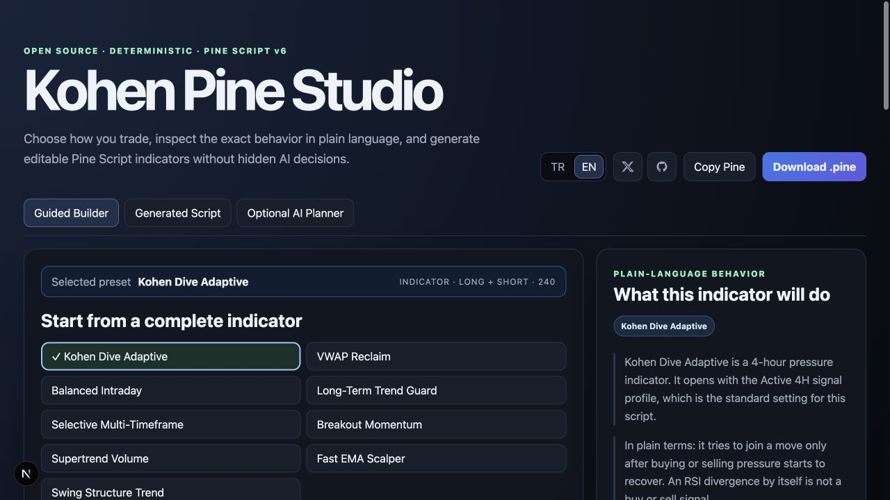
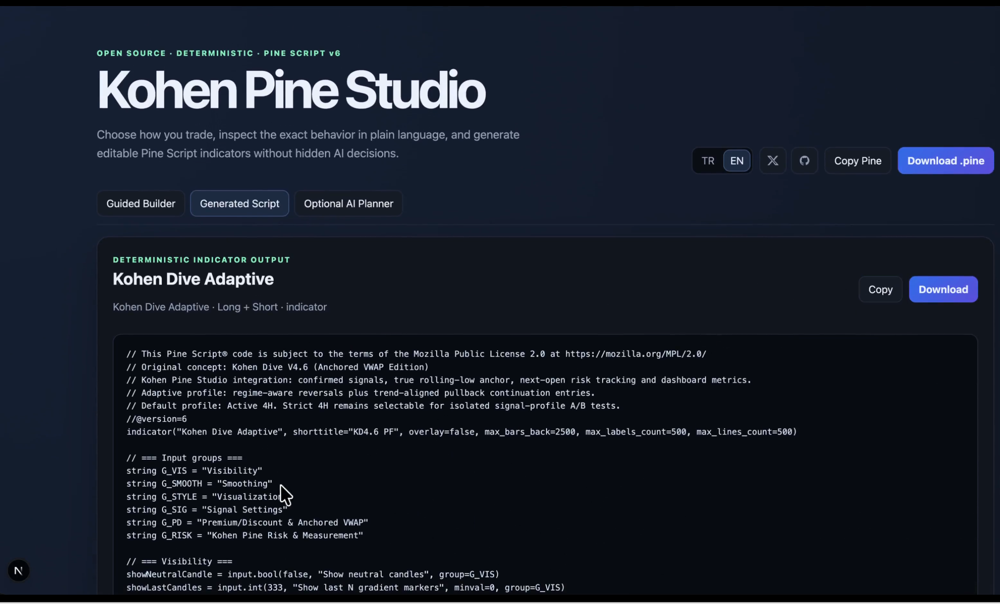

# Kohen Pine Studio

Kohen Pine Studio is an open-source builder for editable, deterministic **Pine Script v6 indicators**. Choose a starting preset or configure the rules yourself, review the behavior in plain language, then copy or download the generated code for TradingView.

The Studio is designed to make indicator logic visible. It does not hide trading decisions behind a black box and it does not place Strategy Tester orders for you.

> **Not investment advice.** Generated signals, explanations and historical metrics can be wrong or misleading. They are not a promise of accuracy, profitability or future performance. Inspect every rule and test every script in TradingView before any real-world use.



## Watch the 57-second demo

[](https://www.youtube.com/watch?v=r_Zkg7vEVAs)

See the complete workflow: select Kohen Dive Adaptive, generate editable Pine Script v6, add it to a 4-hour TradingView chart, verify the Active 4H inputs and inspect the dashboard metrics.

## What it does

- Generates editable Pine Script v6 **indicator** code.
- Supports long/short, long-only and spot buy/exit workflows.
- Includes trend, momentum, volume, higher-timeframe, risk and visual controls.
- Shows the selected indicator's behavior in straightforward language before code is generated.
- Adds optional TradingView alert conditions to generated scripts.
- Draws visual stop and target guidance when the selected configuration uses it.
- Provides an optional AI planner that suggests a visible configuration; the deterministic builder remains the source of truth.

## What it does not do

- It does not guarantee profitable, accurate or timely signals.
- It does not execute trades, connect to an exchange or send Strategy Tester orders.
- It does not replace position sizing, risk management or independent testing.
- It does not treat a historical result as proof that a setting will work in the future.

## Presets

Start from a complete indicator, then adjust it in the Guided Builder. **Kohen Dive Adaptive** is listed first, followed by the currently reviewed presets.

Preset order is a product-navigation choice, not a ranking or a performance promise. Where prior reviews exist, the order considers four-symbol consistency, net result and sample strength together; it must never be read as financial advice or a forecast.

Each generated script remains editable in TradingView. Its inputs expose the settings needed to inspect and change its behavior.

## Using the Studio

1. Open the Guided Builder.
2. Select a preset or create a custom configuration.
3. Check the plain-language explanation and each visible setting.
4. Generate the Pine code.
5. Copy it or download the `.pine` file.
6. In TradingView, open **Pine Editor**, paste the code, save it and add it to the chart.
7. Use the prescribed chart timeframe shown by the dashboard. If the chart timeframe differs, the script marks it as `WRONG` and blocks signals when timeframe enforcement is enabled.
8. Inspect and backtest the result before relying on any signal.

Generated code is an indicator. Dashboard fields, entry markers, risk lines and outcome labels are visual tools; they are not trade execution or a substitute for the TradingView Strategy Tester.

## Kohen Dive Adaptive

Kohen Dive Adaptive is the primary 4-hour preset in the Studio. Its default **Active 4H** profile uses confirmed candles, state-recovery reversal logic, hybrid continuation recovery and a two-bar signal cooldown. The alternative **Strict 4H** profile remains inside the same generated script for direct A/B comparison.

The default Active 4H risk settings are ATR 14, an ATR stop multiple of 1.75 and a 1.75 risk/reward target. These are script defaults, not recommendations. The dashboard identifies the active profile and reports the script's visual outcome counters.

## Language

The interface chooses Turkish or English from the browser language on first visit. Visitors can switch languages at any time; their choice is saved in the browser.

## Optional AI planner

The guided builder works fully without AI. The optional planner accepts a plain-language request and returns a suggested configuration that you can inspect and change before generating code.

To enable it locally, copy `.env.example` to `.env.local` and provide credentials for one supported provider:

```env
# Gemini example
AI_PROVIDER=gemini
GEMINI_API_KEY=your_key
GEMINI_MODEL=gemini-2.5-flash

# Or OpenAI example
# AI_PROVIDER=openai
# OPENAI_API_KEY=your_key
# OPENAI_MODEL=gpt-4.1-mini
```

Keep `.env.local` private. Never commit provider keys or add them to client-side code. The AI planner is optional and should not be used as a source of market advice.

## Local development

Requirements:

- Node.js 20 LTS or a compatible current Node.js release
- A package manager compatible with `package-lock.json`

Install dependencies and start the development server:

```bash
npm install
npm run dev
```

For a production check:

```bash
npm test
npm run build
```

In the protected local environment used to maintain this repository, use its safe Node wrappers instead of raw package-manager commands.

## Deploying to Vercel

This is a standard Next.js App Router project. Vercel detects it automatically when the repository is imported; a `vercel.json` file is not required for the current setup.

1. Push the repository to GitHub.
2. Import the repository in Vercel.
3. Keep the detected **Next.js** framework preset and default build settings.
4. Add any optional AI environment variables in Vercel's project settings. Do not upload or commit `.env.local`.
5. Deploy and use the generated preview URL to verify the build, favicon and generated-code flow.

Add `vercel.json` only if the project later needs deployment-specific behavior such as custom rewrites, headers, cron jobs or nonstandard build settings.

## Security

Please read [SECURITY.md](SECURITY.md) before reporting a vulnerability. Do not include API keys, credentials or private trading information in an issue.

## Contributing and support

Bug reports, documentation improvements, translations and small, focused code changes are welcome. Start with [CONTRIBUTING.md](CONTRIBUTING.md), use the provided issue forms, and keep a pull request limited to one clear improvement.

Use GitHub Discussions for questions and preset ideas that are not yet a defined bug or implementation task. For security-sensitive reports, follow [SECURITY.md](SECURITY.md) instead of opening a public issue.

## License

Released under the [MIT License](LICENSE).
